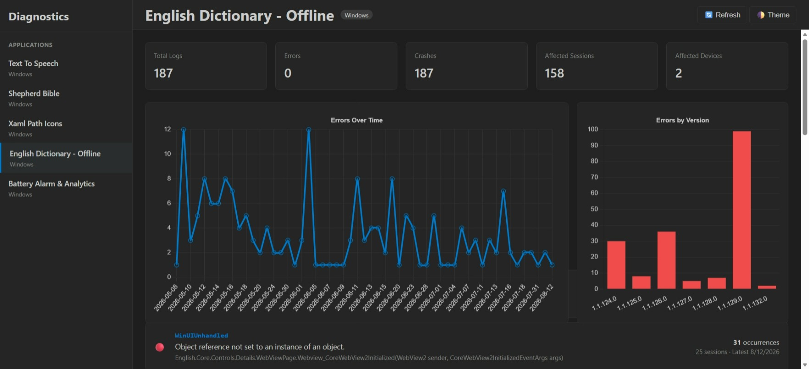
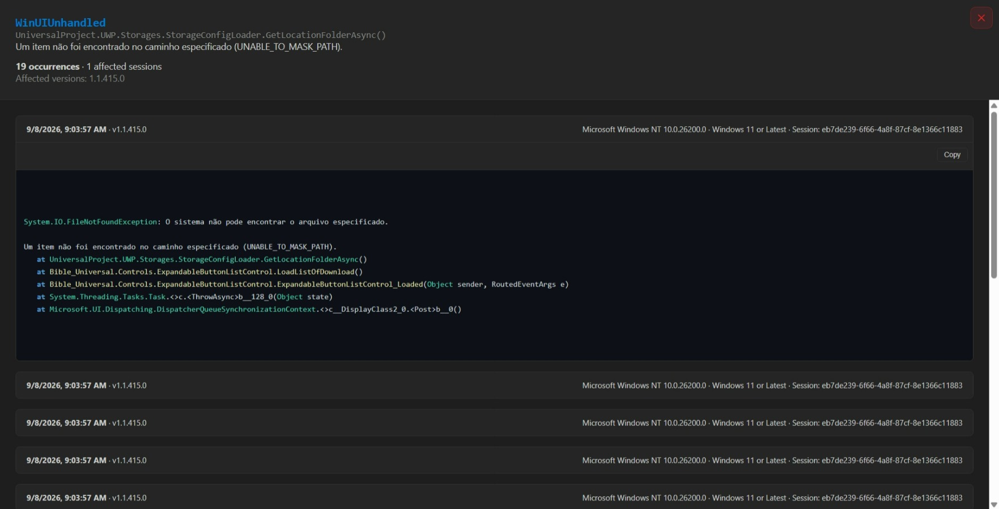

# App Diagnostics Web

A web-based diagnostics dashboard for viewing, analyzing, and monitoring application diagnostic logs.

The project is built with **Vite + TypeScript** and is designed to run as:

* A standalone web application
* A desktop WebView/WebView2 application
* A diagnostics dashboard for WinUI, Flutter, and other applications

The primary production backend is **Cloudflare Workers + Cloudflare D1**.





---

# Architecture

The current production architecture is:

```text
┌──────────────────────────────┐
│      Client Applications     │
│                              │
│  WinUI / Flutter / Web       │
└──────────────┬───────────────┘
               │
               │ POST /api/logs
               ▼
┌──────────────────────────────┐
│      Cloudflare Worker       │
│                              │
│   HTTP API / Validation /    │
│   D1 database access         │
└──────────────┬───────────────┘
               │
               ▼
┌──────────────────────────────┐
│        Cloudflare D1         │
│                              │
│            apps              │
│            logs              │
└──────────────┬───────────────┘
               │
               │ GET /api/apps
               │ GET /api/logs
               ▼
┌──────────────────────────────┐
│      App Diagnostics Web     │
│                              │
│       Vite + TypeScript      │
│                              │
│ API → Services → State       │
│              ↓               │
│          Components          │
│              ↓               │
│          Dashboard           │
└──────────────────────────────┘
```

The dashboard does **not** access D1 directly.

All production database access is performed by the Cloudflare Worker API.

This keeps SQL queries, database implementation details, and backend infrastructure outside the frontend.

---

# Production Backend

## Cloudflare Workers + D1

Cloudflare Workers provides the HTTP API and Cloudflare D1 provides persistent SQL storage.

```text
Application

     │
     │ diagnostic log
     ▼

Cloudflare Worker

     │
     │ SQL
     ▼

Cloudflare D1

     │
     │ HTTP / JSON
     ▼

App Diagnostics Web
```

The Worker is the database boundary between client applications, the dashboard, and D1.

### Worker

The Worker project is maintained separately from this frontend repository.

```text
app-diagnostics-api
```

The production API endpoint is intentionally not documented in this repository.

The Worker exposes the following API routes:

```text
GET  /api/apps
GET  /api/logs
POST /api/logs
```

### D1 Database

The production diagnostics database is:

```text
app-diagnostics-db
```

The Worker accesses D1 through its configured database binding.

---

# API Endpoints

## Get Applications

```http
GET /api/apps
```

Returns the applications registered with the diagnostics system.

Example response:

```json
{
  "apps": [
    {
      "app_name_log": "shepherd-bible-windows",
      "app_name": "Shepherd Bible",
      "platform": "windows"
    }
  ]
}
```

Application registration is stored in the `apps` table.

---

## Get Diagnostic Logs

```http
GET /api/logs?app_name_log=<application>
```

Example:

```text
GET /api/logs?app_name_log=shepherd-bible-windows
```

The API supports incremental retrieval using a timestamp cursor:

```text
GET /api/logs?app_name_log=shepherd-bible-windows&since=2026-09-10T12:00:00.000Z
```

A result limit can also be specified:

```text
GET /api/logs?app_name_log=shepherd-bible-windows&limit=5000
```

The Worker limits requests to a maximum of 5,000 records per request.

---

## Create Diagnostic Log

```http
POST /api/logs
Content-Type: application/json
```

Example:

```json
{
  "id": "unique-log-id",
  "app_name": "Shepherd Bible",
  "app_name_log": "shepherd-bible-windows",
  "app_version": "1.1.420.0",
  "device": "HUAWEI NDZ-WXX9",
  "level": "info",
  "message": "Initialization complete.",
  "os_version": "Windows 11",
  "platform": "windows",
  "session_id": "session-id",
  "stack_trace": "",
  "tag": "startup",
  "timestamp": "2026-09-11T10:00:00.000Z",
  "type": "Startup",
  "duration": 11000,
  "info": "Database initialized | Cache loaded | Books: 66"
}
```

The `id` is the unique identifier for the diagnostic event.

The Worker uses:

```sql
INSERT OR IGNORE
```

for log insertion.

This makes log delivery **idempotent**.

If a client retries the same log because of a network failure or pending-queue retry, the same log ID will not create a duplicate record.

---

# Cloudflare D1 Database

The production diagnostics database contains two primary application tables:

```text
Cloudflare D1
│
├── apps
│
└── logs
```

---

# `apps`

The `apps` table contains applications registered with the diagnostics system.

Schema:

```sql
CREATE TABLE apps (
    app_name_log TEXT PRIMARY KEY,
    app_name TEXT NOT NULL,
    platform TEXT
);
```

Fields:

| Field          | Type | Description                     |
| -------------- | ---- | ------------------------------- |
| `app_name_log` | TEXT | Unique application identifier   |
| `app_name`     | TEXT | Human-readable application name |
| `platform`     | TEXT | Application platform            |

Example:

```text
app_name_log:
shepherd-bible-windows

app_name:
Shepherd Bible

platform:
windows
```

The Worker registers the application automatically when a diagnostic log is submitted.

It uses:

```sql
INSERT OR IGNORE
```

so repeated diagnostic logs do not create duplicate application entries.

---

# `logs`

The `logs` table contains individual diagnostic events.

Current fields:

```text
logs
│
├── id
├── app_name
├── app_name_log
├── app_version
├── device
├── expire_at
├── level
├── message
├── os_version
├── platform
├── session_id
├── stack_trace
├── tag
├── timestamp
├── type
├── duration
└── info
```

Conceptual schema:

```sql
CREATE TABLE logs (
    id TEXT PRIMARY KEY,
    app_name TEXT,
    app_name_log TEXT NOT NULL,
    app_version TEXT,
    device TEXT,
    expire_at TEXT,
    level TEXT,
    message TEXT,
    os_version TEXT,
    platform TEXT,
    session_id TEXT,
    stack_trace TEXT,
    tag TEXT,
    timestamp TEXT NOT NULL,
    type TEXT,
    duration INTEGER,
    info TEXT
);
```

---

# Diagnostic Log Fields

## `id`

Unique diagnostic event identifier.

The client generates this value.

It allows retry-safe log delivery.

---

## `app_name`

Human-readable application name.

Example:

```text
Shepherd Bible
```

---

## `app_name_log`

Stable application/platform identifier.

Example:

```text
shepherd-bible-windows
```

This is the primary application filter used by the API.

---

## `app_version`

Application version.

Example:

```text
1.1.420.0
```

Used for:

* Version filtering
* Regression detection
* Version comparisons
* Diagnostic analysis

---

## `device`

Device model or hardware information.

Example:

```text
HUAWEI NDZ-WXX9
```

---

## `expire_at`

Optional expiration timestamp.

This field can support future per-log retention policies.

---

## `level`

Diagnostic severity.

Examples:

```text
info
warning
error
fatal
```

---

## `message`

Human-readable diagnostic message.

Example:

```text
Initialization complete.
```

---

## `os_version`

Operating-system information.

Example:

```text
Windows 11 | 10.0.26200
```

---

## `platform`

Client platform.

Examples:

```text
windows
android
ios
web
macos
```

---

## `session_id`

Identifies the application session associated with the event.

This allows the dashboard to analyze failures by session and determine how many sessions were affected by a particular problem.

---

## `stack_trace`

Exception or diagnostic stack trace.

Example:

```text
System.NullReferenceException: Object reference not set...

at ReaderPage.Load()

at ReaderPage.Initialize()
```

---

## `tag`

Optional diagnostic category.

Examples:

```text
startup
database
backup
reader
tts
network
subscription
```

---

## `timestamp`

UTC timestamp when the event occurred.

Example:

```text
2026-09-11T10:00:00.000Z
```

UTC timestamps allow logs from different platforms and geographic locations to be compared consistently.

---

## `type`

Diagnostic event type.

Examples:

```text
Startup
Crash
Exception
Database
Network
Backup
Subscription
```

---

## `duration`

Optional numeric duration in milliseconds.

Example:

```json
{
  "duration": 11000
}
```

The dashboard displays this as:

```text
Duration: 11.0 s
```

Duration can be used for events such as:

* Application startup
* Database initialization
* Backup operations
* Cache loading
* Network operations
* File migration
* Synchronization

The value is stored as a D1 `INTEGER`.

---

## `info`

Optional additional diagnostic information.

The field can contain multiple diagnostic values while remaining flexible for different client platforms.

Example:

```text
OS: Windows 11 (10.0.26200) |
Device: HUAWEI NDZ-WXX9 |
CPU: Intel Core i5-1135G7 (8 Cores) |
RAM: 15.8 GB (844.23 MB Free) |
Storage: 52.66 GB Free / 461.23 GB |
Memory: 171.41 MB |
MemoryStatus: OverLimit |
WiFi: PLDT Home WIFI |
Internet: No Internet |
Region: PH (en-US) |
Timezone: UTC+08:00
```

The dashboard presents this information in semantic groups:

```text
System Specs

App Diagnostics

Network & Locale

Additional Info
```

This keeps the stored information flexible while providing a structured user interface.

---

# Cloudflare Worker Responsibilities

The Worker is the only production component that communicates directly with D1.

Its responsibilities include:

1. Receive diagnostic logs.
2. Validate required fields.
3. Register applications.
4. Store diagnostic logs.
5. Prevent duplicate log insertion.
6. Query application-specific logs.
7. Support incremental timestamp-based retrieval.
8. Limit result size.
9. Return JSON responses.
10. Periodically remove old diagnostic data.

The frontend does not contain D1 SQL queries.

---

# Incremental Log Retrieval

The dashboard can request only logs created after a known timestamp.

Example:

```text
GET /api/logs
    ?app_name_log=shepherd-bible-windows
    &since=2026-09-11T10:00:00.000Z
```

The Worker performs a query conceptually equivalent to:

```sql
SELECT
    id,
    app_name,
    app_name_log,
    app_version,
    device,
    expire_at,
    level,
    message,
    os_version,
    platform,
    session_id,
    stack_trace,
    tag,
    timestamp,
    type,
    duration,
    info
FROM logs
WHERE app_name_log = ?
  AND timestamp > ?
ORDER BY timestamp ASC
LIMIT ?;
```

This is useful when the dashboard already has previously loaded diagnostic data.

Instead of downloading the complete history every time, it can request only newer records.

---

# Data Retention

Diagnostic logs are retained for a limited period.

Current retention:

```text
60 days
```

The Worker cleanup operation removes records older than the configured retention period.

Conceptually:

```sql
DELETE FROM logs
WHERE timestamp < cutoff;
```

Cleanup runs through a Cloudflare Cron Trigger.

The application registry in `apps` is not removed during diagnostic log cleanup.

This means application registration survives diagnostic log retention.

```text
apps
  │
  └── Persistent application registry

logs
  │
  └── Temporary diagnostic history
```

---

# Dashboard Data Flow

The normal production flow is:

```text
User opens dashboard
        │
        ▼
Load application list
        │
        ▼
GET /api/apps
        │
        ▼
Cloudflare Worker
        │
        ▼
D1 apps
        │
        ▼
Application list
        │
        ▼
User selects application
        │
        ▼
GET /api/logs
        │
        ▼
Cloudflare Worker
        │
        ▼
D1 logs
        │
        ▼
RawLog[]
        │
        ▼
logService
        │
        ▼
ProcessedLog[]
        │
        ▼
errorGroupingService
        │
        ▼
ErrorGroup[]
        │
        ▼
Dashboard
```

---

# Dashboard Responsibilities

The frontend is responsible for visualization and analysis.

It does not perform database operations.

The dashboard can:

* Display registered applications
* Load application logs
* Group similar exceptions
* Count occurrences
* Identify affected sessions
* Compare application versions
* Detect possible regressions
* Search diagnostic messages
* Filter by application version
* Display stack traces
* Display device information
* Display operating-system information
* Display duration
* Display structured diagnostic information
* Visualize diagnostic activity
* Cache loaded data locally
* Provide light and dark themes
* Run inside a desktop WebView

---

# Frontend Architecture

The dashboard follows a layered architecture:

```text
Backend API
     │
     ▼
API Layer
     │
     ▼
Services
     │
     ▼
Application State
     │
     ▼
Components
     │
     ▼
Dashboard UI
```

Backend-specific code remains inside the API layer.

Business logic remains inside services.

UI logic remains inside components.

---

# Frontend Structure

```text
src/
│
├── api/
│   ├── cloudflareApi.ts
│   ├── appScriptApi.ts
│   └── firebaseApi.ts
│
├── charts/
│   └── chart.ts
│
├── components/
│   ├── appList.ts
│   ├── dashboard.ts
│   ├── detailView.ts
│   ├── events.ts
│   └── theme.ts
│
├── config/
│   └── config.ts
│
├── mock/
│   └── mockData.ts
│
├── models/
│   ├── errorGroup.ts
│   ├── processedLog.ts
│   └── rawLog.ts
│
├── services/
│   ├── errorGroupingService.ts
│   ├── filterService.ts
│   └── logService.ts
│
├── state/
│   └── appState.ts
│
├── utils/
│   └── htmHelper.ts
│
├── main.ts
├── index.html
└── style.css
```

---

# API Layer

## `cloudflareApi.ts`

The primary production API implementation.

Responsibilities:

* Load applications
* Load diagnostic logs
* Pass `app_name_log`
* Pass incremental `since` timestamps
* Pass result limits
* Parse JSON responses
* Handle HTTP errors

Typical operations:

```ts
fetchApps()
```

```ts
fetchLogs(appNameLog)
```

```ts
fetchLogs(appNameLog, since)
```

The Cloudflare API layer should contain network communication only.

It should not contain:

* UI rendering
* Error grouping
* Dashboard state
* Chart rendering

---

# Models

## `rawLog.ts`

Represents raw data returned by the backend.

Example:

```ts
export interface RawLog {
  id: string;
  app_name: string;
  app_name_log: string;
  app_version: string;
  device: string;
  expire_at: string | null;
  level: string;
  message: string;
  os_version: string;
  platform: string;
  session_id: string;
  stack_trace: string;
  tag: string;
  timestamp: string;
  type: string;
  duration: number | null;
  info: string | null;
}
```

The model mirrors the Cloudflare API response.

---

# Processed Logs

`processedLog.ts` represents a diagnostic event after frontend processing.

Processing can extract:

* Exception type
* Main stack frame
* Short message
* Grouping key
* Version information
* Session information
* Diagnostic metadata

Flow:

```text
RawLog
  │
  ▼
Log Processing
  │
  ▼
ProcessedLog
```

---

# Error Groups

`errorGroup.ts` represents multiple diagnostic events that appear to belong to the same underlying problem.

For example:

```text
System.NullReferenceException
    at ReaderPage.Load()

System.NullReferenceException
    at ReaderPage.Load()

System.NullReferenceException
    at ReaderPage.Load()
```

Can become:

```text
NullReferenceException

ReaderPage.Load()

Occurrences: 3
Affected Sessions: 2
Versions: 1.1.418.0, 1.1.419.0
```

This makes large diagnostic datasets easier to understand.

---

# Services

## `logService.ts`

Responsible for:

* Loading logs
* Processing raw logs
* Extracting exception information
* Extracting stack frames
* Sorting records
* Grouping records
* Preparing dashboard data

---

## `errorGroupingService.ts`

Determines when multiple diagnostic events represent the same underlying problem.

Grouping can consider:

* Exception type
* Main stack frame
* Error message
* Diagnostic type

---

## `filterService.ts`

Provides reusable filtering logic.

Examples:

```text
Application version

Exception type

Search text

Diagnostic type
```

---

# Application State

`src/state/appState.ts` maintains dashboard state.

Example state:

```text
Available applications

Current application

Loaded logs

Filtered logs

Error groups

Selected filters

Current theme

Chart state
```

The state layer keeps data separate from UI rendering.

---

# Components

## `appList.ts`

Displays applications retrieved from the Cloudflare Worker.

Example:

```text
Applications

Shepherd Bible

Cash References

English Word Search
```

---

## `dashboard.ts`

Displays the primary diagnostic dashboard.

Includes:

* Summary statistics
* Error groups
* Charts
* Filters
* Application information

---

## `detailView.ts`

Displays detailed information for an error group.

Includes:

* Exception type
* Main stack frame
* Error message
* Occurrence count
* Affected sessions
* Application versions
* Stack traces
* Device information
* OS information
* Diagnostic information
* Duration

Diagnostic information is visually grouped into:

```text
System Specs

App Diagnostics

Network & Locale

Additional Info
```

---

## `events.ts`

Contains UI event handling.

Examples:

* Application selection
* Filter changes
* Error selection
* Detail view opening
* Detail view closing
* Copy stack trace
* Theme changes

---

## `theme.ts`

Controls light and dark theme state.

---

# Charts

`src/charts/chart.ts` contains chart-related functionality.

Possible visualizations include:

```text
Errors over time

Errors by version

Errors by type

Error frequency

Affected sessions
```

Charts are kept separate from dashboard rendering so they can be reused.

---

# Diagnostic Detail View

Each error occurrence can expose a detailed diagnostic section.

Example:

```text
Stack Trace
────────────────────────────────────────

System.NullReferenceException

    at ReaderPage.Load()

    at ReaderPage.Initialize()

────────────────────────────────────────

System Specs

┌────────────────────────────────────────┐
│ OS       Windows 11 (10.0.26200)      │
│ Device   HUAWEI NDZ-WXX9              │
│ CPU      Intel Core i5-1135G7 (8 Cores)│
│ RAM      15.8 GB (844 MB Free)        │
└────────────────────────────────────────┘

App Diagnostics

┌────────────────────────────────────────┐
│ Memory        171.41 MB               │
│ MemoryStatus  OverLimit               │
│ Duration      13.0 s                  │
└────────────────────────────────────────┘

Network & Locale

┌────────────────────────────────────────┐
│ WiFi        PLDT Home WIFI            │
│ Internet    No Internet               │
│ Region      PH (en-US)                │
│ Timezone    UTC+08:00                 │
└────────────────────────────────────────┘
```

---

# Mock Data

`src/mock/mockData.ts` contains development and test diagnostic data.

Mock data allows frontend development without requiring access to the production Cloudflare backend.

This is useful for:

* UI development
* Error-grouping development
* Detail-view development
* Chart development
* Offline development

Mock data must not be confused with production D1 data.

---

# Backend Abstraction

The frontend is designed around a common diagnostic data model.

The primary backend is:

```text
Cloudflare Worker + D1
```

Legacy or alternative backends include:

```text
Google Apps Script + Google Sheets

Firebase Firestore
```

The dashboard should not need to change when the backend changes.

Backend-specific differences remain isolated inside the API layer.

---

# Legacy Google Apps Script Backend

The original diagnostics implementation used Google Apps Script and Google Sheets.

Architecture:

```text
Application
     │
     ▼
Google Sheets
     │
     ▼
Google Apps Script
     │
     │ HTTP / JSON
     ▼
App Diagnostics Web
```

The Apps Script backend remains available for applications that still depend on the existing Google Sheets diagnostics infrastructure.

It is not the primary production backend.

---

# Legacy Firebase Firestore Backend

Firebase Firestore was also used as an alternative diagnostics backend.

Architecture:

```text
Application
     │
     ▼
Firebase Firestore
     │
     ▼
App Diagnostics Web
```

The previous diagnostics implementation used application and log collections.

Firestore remains an alternative/legacy backend.

It is not the primary production backend.

---

# Why Cloudflare D1 Is the Primary Backend

Cloudflare D1 provides a SQL-based diagnostic store behind the Worker API.

The architecture provides:

```text
Applications
      │
      ▼
Cloudflare Worker
      │
      ▼
D1
      │
      ▼
Dashboard
```

Advantages include:

* SQL-based storage
* Centralized API access
* Simple HTTP/JSON integration
* Idempotent log delivery
* Application-specific queries
* Timestamp-based incremental retrieval
* Server-side result limits
* Automatic retention cleanup
* No database credentials in the frontend
* Easy integration with WinUI and Flutter clients
* Independent dashboard deployment
* Cloudflare-managed infrastructure

---

# Security Boundary

The frontend communicates only with the public Worker API.

```text
Browser

   │
   │ HTTPS
   ▼

Cloudflare Worker

   │
   │ D1 binding
   ▼

Cloudflare D1
```

The browser does not receive:

* D1 credentials
* Cloudflare API tokens
* Cloudflare account credentials
* Database credentials

The API endpoint is public by design because clients need to communicate with it.

Private Cloudflare credentials must never be embedded in the frontend.

---

# Client Log Delivery

Client applications can maintain a local pending-log queue.

Typical flow:

```text
Application generates log
          │
          ▼
Local pending queue
          │
          ▼
POST /api/logs
          │
     ┌────┴────┐
     │         │
   Success   Failure
     │         │
     ▼         ▼
  Remove    Keep pending
  from queue for retry
```

Because each diagnostic log contains a stable `id`, retrying the same log is safe.

The Worker uses:

```sql
INSERT OR IGNORE
```

to prevent duplicate records.

---

# Application Registration

An application does not need a separate registration request.

When a log is received:

```text
POST /api/logs
```

the Worker automatically ensures that the application exists in:

```text
apps
```

using:

```sql
INSERT OR IGNORE
```

Example:

```text
shepherd-bible-windows
        │
        ▼
apps
        │
        ├── app_name_log
        ├── app_name
        └── platform
```

This keeps application discovery simple.

---

# Data Retention Strategy

Diagnostic logs are intentionally temporary.

Current policy:

```text
60-day diagnostic retention
```

The application registry is persistent:

```text
apps
  ↓
persistent
```

Diagnostic events are temporary:

```text
logs
  ↓
60-day retention
```

This keeps the database from growing indefinitely while preserving the list of known applications.

---

# Repository Separation

The web dashboard and Cloudflare Worker are separate projects.

```text
app-diagnostics.web

        │
        │ HTTP
        ▼

app-diagnostics-api

        │
        ▼

Cloudflare D1
```

## Dashboard repository

```text
nextcodelab/app-diagnostics.web
```

Contains:

```text
Vite

TypeScript

HTML

CSS

Dashboard components

Charts

API clients

Frontend services
```

## Worker repository

```text
app-diagnostics-api
```

Contains:

```text
Cloudflare Worker

Hono

Chanfana

D1 access

API endpoints

Retention cleanup
```

This separation allows the frontend and backend to have independent release cycles.

---

# Relationship With WinUI

The WinUI application remains independent from the dashboard repository.

```text
┌─────────────────────────┐
│        WinUI App        │
│                         │
│   Diagnostic Logger     │
└────────────┬────────────┘
             │
             │ HTTPS POST
             ▼
┌─────────────────────────┐
│    Cloudflare Worker    │
│                         │
│   app-diagnostics-api   │
└────────────┬────────────┘
             │
             ▼
┌─────────────────────────┐
│      Cloudflare D1      │
└────────────┬────────────┘
             │
             │ HTTPS GET
             ▼
┌─────────────────────────┐
│   App Diagnostics Web   │
└─────────────────────────┘
```

The WinUI application does not need to contain dashboard code.

The dashboard can also be embedded into the WinUI application through WebView/WebView2 when required.

---

# Standalone Web Application

The project uses:

```text
Vite + TypeScript
```

It can run independently in a browser.

Development:

```bash
npm install
npm run dev
```

TypeScript validation:

```bash
npx tsc --noEmit
```

Production build:

```bash
npm run build
```

Production output:

```text
dist/
```

The project uses a relative Vite base path so that generated resources can also work in desktop WebView environments.

---

# Local Development

Install dependencies:

```bash
npm install
```

Start the development server:

```bash
npm run dev
```

Run TypeScript validation:

```bash
npx tsc --noEmit
```

Build the production application:

```bash
npm run build
```

Preview the production build:

```bash
npm run preview
```

---

# Cloudflare Worker Development

The Worker repository can be developed independently.

Install dependencies:

```bash
npm install
```

Run locally:

```bash
npx wrangler dev
```

Deploy:

```bash
npx wrangler deploy
```

Inspect the remote D1 database:

```bash
npx wrangler d1 execute app-diagnostics-db --remote --command "SELECT name FROM sqlite_master WHERE type='table' ORDER BY name;"
```

Inspect registered applications:

```bash
npx wrangler d1 execute app-diagnostics-db --remote --command "SELECT * FROM apps;"
```

Inspect recent diagnostic logs:

```bash
npx wrangler d1 execute app-diagnostics-db --remote --command "SELECT id, app_name_log, timestamp, duration, info FROM logs ORDER BY timestamp DESC LIMIT 10;"
```

---

# Example D1 Query

Application logs:

```sql
SELECT
    id,
    app_name,
    app_name_log,
    app_version,
    platform,
    level,
    type,
    message,
    stack_trace,
    device,
    os_version,
    session_id,
    tag,
    timestamp,
    duration,
    info
FROM logs
WHERE app_name_log = ?
ORDER BY timestamp ASC
LIMIT ?;
```

Incremental query:

```sql
SELECT
    id,
    app_name,
    app_name_log,
    app_version,
    platform,
    level,
    type,
    message,
    stack_trace,
    device,
    os_version,
    session_id,
    tag,
    timestamp,
    duration,
    info
FROM logs
WHERE app_name_log = ?
  AND timestamp > ?
ORDER BY timestamp ASC
LIMIT ?;
```

---

# Example Diagnostic Event

A startup diagnostic event may contain:

```json
{
  "id": "startup-123",
  "app_name": "Shepherd Bible",
  "app_name_log": "shepherd-bible-windows",
  "app_version": "1.1.420.0",
  "platform": "windows",
  "level": "info",
  "type": "Startup",
  "message": "Application initialization completed.",
  "timestamp": "2026-09-11T10:00:00.000Z",
  "duration": 13000,
  "info": "OS: Windows 11 (10.0.26200) | Device: HUAWEI NDZ-WXX9 | CPU: Intel Core i5-1135G7 (8 Cores) | RAM: 15.8 GB (844 MB Free) | Storage: 52.66 GB Free / 461.23 GB | Memory: 171.41 MB | MemoryStatus: OverLimit | WiFi: PLDT Home WIFI | Internet: No Internet | Region: PH (en-US) | Timezone: UTC+08:00"
}
```

The backend stores the event as a single D1 row.

The frontend transforms the diagnostic information into a readable diagnostic panel.

---

# Diagnostic Analysis

The dashboard is designed to analyze individual logs as well as groups of related errors.

Example:

```text
100 diagnostic events
        │
        ▼
Log processing
        │
        ▼
Exception extraction
        │
        ▼
Stack-frame extraction
        │
        ▼
Error grouping
        │
        ▼
10 error groups
```

Each error group can expose:

```text
Exception

Main stack frame

Occurrences

Affected sessions

Affected versions

Latest occurrence

Diagnostic details
```

This makes the dashboard useful for identifying recurring production problems rather than simply displaying raw log records.

---

# Performance Strategy

The architecture is designed to avoid unnecessary data transfer.

The Worker provides:

```text
Application filter

Timestamp cursor

Result limit
```

The dashboard can therefore request only the records it needs.

For example:

```text
First request
    ↓
Initial diagnostic data

Later request
    ↓
Only records newer than the last timestamp
```

The frontend can additionally cache previously processed data locally.

---

# Design Principles

The project follows several architectural principles.

## Cloudflare-first

Cloudflare Workers + D1 is the primary production backend.

## Backend isolation

The dashboard should not depend directly on a particular database implementation.

## API boundary

The Worker provides the database API boundary.

## Idempotent ingestion

Diagnostic logs use stable IDs and:

```sql
INSERT OR IGNORE
```

## Incremental retrieval

The `since` timestamp allows efficient synchronization.

## Controlled retention

Diagnostic logs are automatically removed after the retention period.

## Separate responsibilities

```text
Worker
    → API + database

Services
    → processing + analysis

Components
    → UI

Dashboard
    → visualization
```

## WebView compatibility

The production build remains usable as a standalone web application and inside desktop WebView environments.

---

# Future Expansion

The diagnostics infrastructure can be extended beyond traditional crash diagnostics.

Potential event types include:

```text
Startup

Session

Performance

Navigation

Network

Database

Backup

Synchronization

Subscription

TTS

Crash

Exception
```

For example:

```text
Startup
    duration = 13,000 ms

Database initialization
    duration = 2,100 ms

Backup
    duration = 4,800 ms

Session
    duration = 1,240,000 ms
```

The same infrastructure can therefore support both traditional error diagnostics and application-performance telemetry.

---

# Backend Status

| Backend                     | Status               | Purpose                |
| --------------------------- | -------------------- | ---------------------- |
| Cloudflare Workers + D1     | **Primary**          | Production diagnostics |
| Google Apps Script + Sheets | Legacy               | Existing applications  |
| Firebase Firestore          | Legacy / Alternative | Existing integrations  |

The dashboard is intentionally capable of supporting multiple backend implementations, but new production development should target **Cloudflare Workers + D1**.

---

# Project Goals

The project aims to provide a diagnostics platform that is:

* Lightweight
* Reliable
* Cloudflare-first
* SQL-backed
* Backend-independent at the UI layer
* Easy to maintain
* Easy to extend
* Suitable for production applications
* Suitable for WinUI WebView integration
* Suitable for Flutter and other clients
* Capable of incremental synchronization
* Capable of automatic retention
* Focused on meaningful diagnostic analysis

The central production architecture is:

```text
┌───────────────────────┐
│   Application Clients │
│                       │
│   WinUI / Flutter     │
│   / Web               │
└───────────┬───────────┘
            │
            │ HTTPS
            ▼
┌───────────────────────┐
│   Cloudflare Worker   │
│                       │
│  app-diagnostics-api  │
└───────────┬───────────┘
            │
            │ D1 binding
            ▼
┌───────────────────────┐
│     Cloudflare D1     │
│                       │
│        apps           │
│        logs           │
└───────────┬───────────┘
            │
            │ HTTPS / JSON
            ▼
┌───────────────────────┐
│  App Diagnostics Web  │
│                       │
│   Vite + TypeScript   │
└───────────────────────┘
```

---

# Repository

Frontend repository:

```text
nextcodelab/app-diagnostics.web
```

Cloudflare backend:

```text
app-diagnostics-api
```

The frontend repository contains the dashboard UI and frontend API abstractions.

The Cloudflare repository contains the Worker API and D1 integration.

Google Apps Script and Firebase implementations are maintained separately as legacy or alternative backends.
